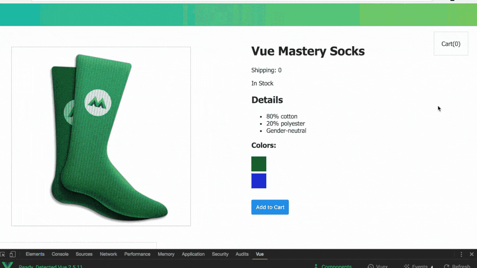

# VueJS cours et exercices -The Vue Instance

Throughout this course you will learn the fundamentals of Vue while we build this product page together. Campus Numérique in the ALPS



## Prerequisites:

This course assumes a foundational knowledge in HTML, CSS and JavaScript.

## Goal:

How to use Vue to display data onto a webpage.

## Starting Code

Start with two files **index.html** and **main.js**

```
<div id ="app">
<h1>Product Name</h1>
</div>

<script src="main.js"></script>
```

Pour plus d'info, vous pouvez visiter ce site [ce site](https://e-real;fr)
